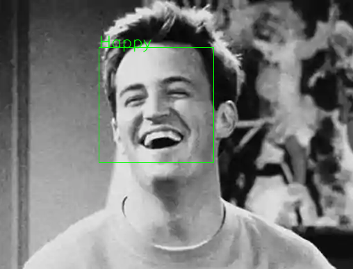

#  emoJ - an emotional journal


# Vision:
------------
Socrates said **“To know thyself is the beginning of wisdom”**. Thus, we use journals, blogs, vlogs and other tools to record and track ourselves to know ourselves better. As the saying goes **“A picture is worth a 1000 words”**, and detecting human emotion from a picture or a video feed is one of the most active fields in computer vision today.  We can leverage the computer vision technology to evaluate, record and track our own emotional state in our daily lives. Therefore, I've built an app that can train, re-train CNN with the use of transfer learning to record and track one's own emotion in an emotion-journal or an e-journal if you will. 
World's foremost expert on facial expressions of humans, **Paul Ekman**, PhD have identified 7 base emotions that are well identified by facial expressions. These are **angry, disgust, fear, happy, sad, surprise, neutral**. 

  

# Data
------------
Researched on the image and video emotional recognition technology and the datasets to benchmark such technology. Downloaded the kaggel facial emotion recognition dataset (**FER2013**, about 35,888 images with size 28x28). To compliment the initial dataset google images were scraped. The final stage of the model will be continually updated and trained for the specific user. Thus the overall effectiveness of the CNN will grow with usage for a given user.

The FER2013 dataset is published as a .csv files and images must be extracted from the flattened pixel matrix therein. Thus, I have followed the convention to handle all images in the project in .csv files. The scraped images after EDA is converted to string of pixels and stored in .csv file. Similarly this method is used to handle images in the Django app as well. This convention is most effecient for the Django app. 


## ROSEMED Methodology 
------------
R - Research O - Obtain S - Scrub E - Explore M - Model E - Evaluate D - Deploy  

During this process,the stages often blur together. It is completely acceptable (and often a best practice!) to float back and forth between stages as you learn new things about your problem, dataset, requirements, etc. It's quite common to get to the modeling step and realize that you need to scrub your data a bit more or engineer a different feature and jump back to the "Scrub" stage, or go all the way back to the "Obtain" stage when you realize your current data isn't sufficient to solve this problem. As with any of the frameworks, this methodology is meant to be treated more like a set of guidelines for structuring your project than set-in-stone steps that cannot be violated.  


# Plan
------------
The overall strategy is a three stage process. 
1. FER2013 dataset is loaded and used to build the initial model. 
2. Scraped images and carefully labelled and used to further refine model built in stage-1
3. Small set of images from a single user is gathered and trained to build the 3rd stage of the model, that will be a continuous improvement with usage. 
In the first, we load the XML file for detecting the presence of faces and then we retrain our network with our image on five diffrent categories. After that, we import the label_image.py program from the [last video]() and set up everything in realtime.

# Steps to build a emotion recongnition model at each stage
------------
Building a model at each stage givien above a 3 fold
1. Using OpenCV ["HAAR CASCADES"](https://github.com/opencv/opencv/tree/master/data/haarcascades) face identification technology faces are identified especially in stages 2 and 3. Only pictures with single face is retained. Then a bounding box of the face is identified and the face alone is croped. 
2. The selected images from step 2 are visually inspected and outliers and incorrect images are removed. 
3. A CNN model is built using Keras library. 


# Dependancies
------------
Following dependancies are required to run this app:

- numpy, pandas, Selenium
- tensorflow, Keras
- opencv-python
- Django, pillow, sqlite3


# Project Outline
------------


    ├── README.md                    <- Project description (this file)
    ├── emoJ/                        <- Django webapp (manage.py) 
    │   ├── emoj/                    <- Django app main organization code. 
    │   │                               added secrets.py to hide the private key  
    │   ├── entries/                 <- code for handling Index and Form update 
    │   │   ├── models.py            <- create the database
	│   │   ├── urls.py              <- add the urls to urlpatterns
    │   │   ├── views.py	         <- class to push data to html templates
    │   │   ├── forms.py             <- class to create input form in app.html
    │   │   └── FER.py               <- CNN inferance to predict emotion and pass it to views.py
    │   ├── manage.py                <- run server          
    │   ├── media/                   <- temperory images for CNN inferance, other static files. 
    │   └── templates/               <- web templates and model files. (improved models ".h5" can be set here)
    │       └── entries              <- index.html and app.html                        
    ├── util/                        <- utility scripts for web scraping and EDA
    │   ├── search_and_download.py   <- Webscrping images from google via selenium
    │   ├── face_crop.py             <- face detection, resize and crop images 
    │   └── face_2_num.py            <- convert croped and cleaned images to a .csv                        
    ├── ppt/                         <- presentation and reports                        
    ├── FED.ipynb                    <- CNN model based on FER2013 dataset                        
    ├── FED_transfer.ipynb           <- CNN model based on web scraped images dataset                         
    └── models/                      <- saved model .h5 files.  


# Findings:
------------

Model|Loss|Accuracy|Val_Loss|Val_Accuracy
-----|----|--------|--------|------------
Base|Model|0.06|0.97|3.10|0.56
Improved Model|0.|0.|0.|0.


__Confusion Matrix for our Test Set-__


# predictions 
For any given image, the app will identify the main face, crop it and then make prediction of the emotional state as a bar chart. 

   


# Conclusion:  
------------
This study presents a deep CNN based approach for the detection of human emotion based on images.


# Recommendations:  
------------
to be added 


# Future Work:
------------
- user authentication and expand DB 
- add retraining model for each user 
- add capability for users to update labels so that model gain accuracy with usage
- deploy the Django webapp 
- develop and deploy Android and IOS apps 


```python

```
